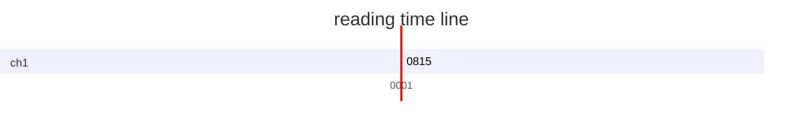
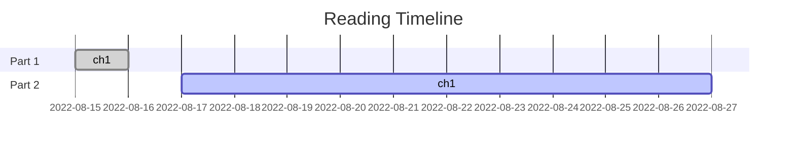
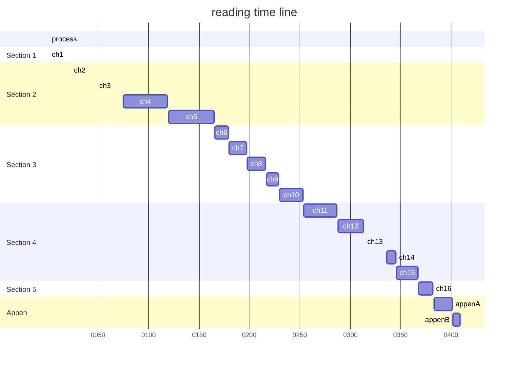

# Fenix Architecture - Building a Reliable Large-Scale Distributed System
## 凤凰架构构建可靠的大型分布式系统-读书笔记
 
| chapter |title| start | finish |process|
| :-----:| :----: | :----: |:----: |:----: |
|ch1|服务架构演进史|2022-08-15|2022-08-15|5.38%|
|ch2|访问远程服务|2022-08-|2022-08-|%|

